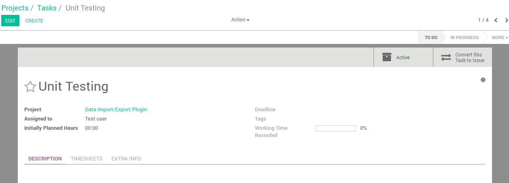
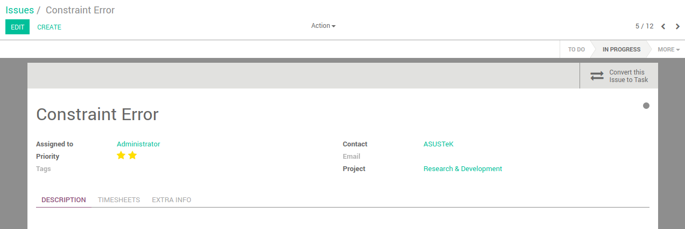

# Convert Task to Issue and vice-versa

## Users & Integrators

### Requirements
Normally incoming mails are converted to Issues, and it's good that way.

Once in a while, we wish to treat an incoming mail as a Task (ex. if it is a Feature Request).

Provide an Action on Issues for converting Issue to Task.

Similarly, provide an Action on Tasks to convert them into Issues.

Along with the conversion, all the messages and timesheets that have been on the task will now be transferred on the new issue.

### Installation
- Place this module in the addons folder of Odoo.
- The modules *Project* and *Timesheets* need to be installed first.

### User Experience
After logging in, go to Project -> click on any project and task or create new ones.
Then in the right upper corner you can notice the button `Convert this task into issue`
and if you click it then the old task will be achieved (set inactive) and
it will lead you automatically on the newly crated issue
(it can be noticed in the URL also that now the model is project.issue). 
- Same goes vice-versa for issues.

### Effected Apps
- Project

### Tests
Tested on v10e.

## Programmers

### Architecture
- The main model inherits *project.task* or *project.issue* respectively where we want to extend the functionality.
All the field values are transfered from the task to the issue or vice-versa and the new task/issue is created.
The old one is set inactive (gets archieved).

### Classes
- The classes are inherited as explained above and their only method is get_data which creates the new issue/task and transfers the values from the one to the other.

### Particular things to note
- We must make sure that in the issue settings/preferences the option for timesheets is selected (to be turned ON because by default it is not and can make errors that timesheet doesn't exist or something like that). Then the same goes vice-versa for the issue that we want to convert into a task. 

### Vulnerable parts
- If the timesheets for issues are not allowed as explained above, an error will be shown.

## Contributors
Dajana Stojchevska <m26@euroblaze.de>

## Licence
All the rights belong to NEBIZ&reg; company.